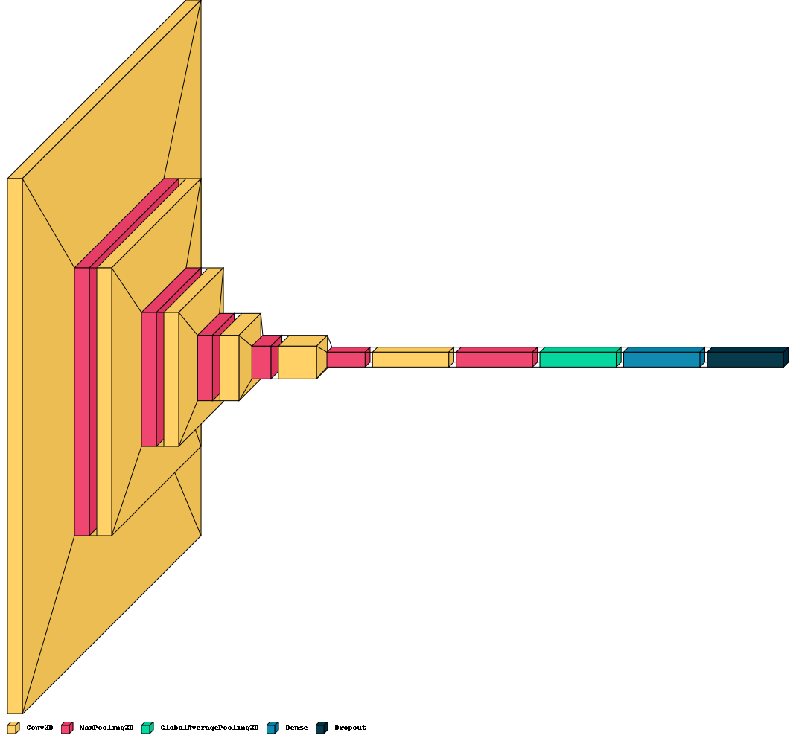
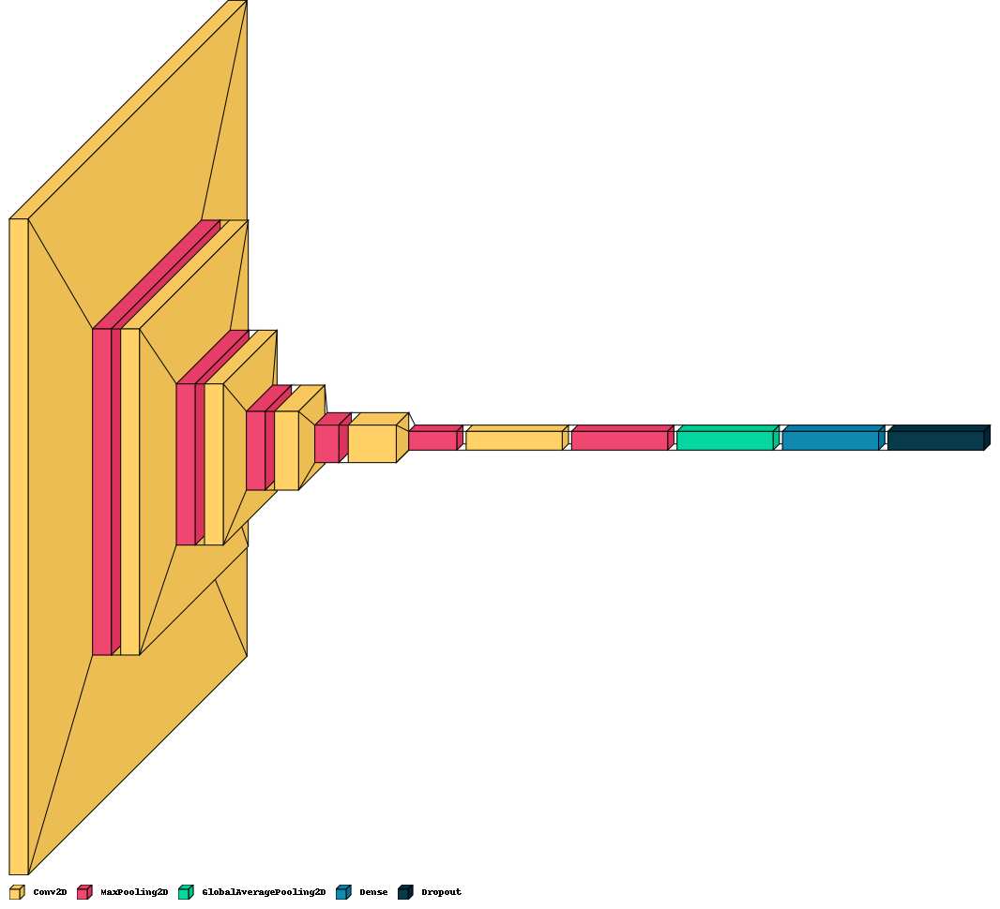
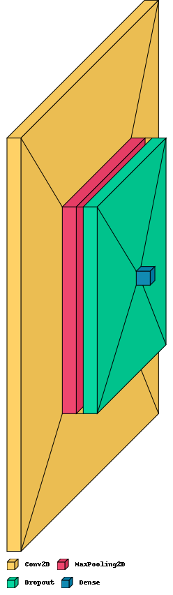
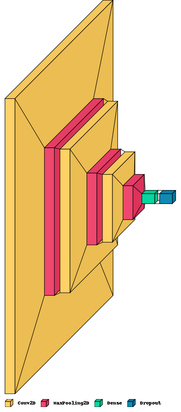

<h1 style="background-color:#C2B4B9;color:white;text-align: center;padding-top: 5px;padding-bottom: 5px;">
<strong><centre>RESULTS AND MODEL COMPARISON </centre></strong></h1>

## Best and worst case scenarios

|                          | Model                     | Architecture                                              | Epochs | Batch Size | Learning Rate | Optimizer | Loss Function            | Training Accuracy | Validation Accuracy | Training Loss | Validation Loss |
|--------------------------|---------------------------|-----------------------------------------------------------|--------|------------|---------------|-----------|--------------------------|-------------------|---------------------|---------------|-----------------|
| **best-case scenarios**  | **custom_cnn_it_06_03**   |     | 30     | 64         | 0.0005        | Adam      | Categorical Crossentropy | 0.87 (87%)        | 0.86 (86%)          | 0.74          | 0.88            |
|                          | **custom_cnn_it_06_02**   |     | 30     | 64         | 0.0005        | Adam      | Categorical Crossentropy | 0.85 (85%)        | 0.83 (83%)          | 0.90          | 0.96            |
|                          | **custom_cnn_it_06_04**   |     | 50     | 64         | 0.0005        | Adam      | Categorical Crossentropy | 0.89 (89%)        | 0.81 (81%)          | 0.74          | 0.89            |
| **worst-case scenarios** | **custom_cnn_base_model** |  | 10     | 32         | 0.0001        | Adam      | Categorical Crossentropy | 0.36 (36%)        | 0.38 (38%)          | 12.22         | 9.78            | 
|                          | **custom_cnn_it_02**      |       | 30     | 64         | 0.0001        | Adam      | Categorical Crossentropy | 0.24 (24%)        | 0.36 (36%)          | 2.39          | 2.09            |
|                          | **custom_cnn_it_01**      |       | 25     | 32         | 0.0001        | Adam      | Categorical Crossentropy | 0.45 (45%)        | 0.65 (65%)          | 1.76          | 1.30            | 

## Training Model Comparison

Here are the differences between the models based on their architectures, hyperparameters, performance metrics, and regularization functions applied.

| Model                     | Architecture                                                                                                                                                                                                                                                                                                                                                                                                                                                                                                                                                                                                                                                                                                                                                                                                                                                                                                                                                                                                                                                                                                                 | Epochs | Batch Size | Learning Rate | Optimizer | Loss Function            | Training Accuracy | Validation Accuracy | Training Loss | Validation Loss | Regularization Functions                                                                             | Key Changes                                                                                                     |
|---------------------------|------------------------------------------------------------------------------------------------------------------------------------------------------------------------------------------------------------------------------------------------------------------------------------------------------------------------------------------------------------------------------------------------------------------------------------------------------------------------------------------------------------------------------------------------------------------------------------------------------------------------------------------------------------------------------------------------------------------------------------------------------------------------------------------------------------------------------------------------------------------------------------------------------------------------------------------------------------------------------------------------------------------------------------------------------------------------------------------------------------------------------|--------|------------|---------------|-----------|--------------------------|-------------------|---------------------|---------------|-----------------|------------------------------------------------------------------------------------------------------|-----------------------------------------------------------------------------------------------------------------|
| **custom_cnn_base_model** | **Input(150, 150, 3)   Conv2D(32, (3, 3), relu)   MaxPooling2D(2, 2)   Dropout(0.3)   Flatten()   Dense(num_classes, softmax)**                                                                                                                                                                                                                                                                                                                                                                                                                                                                                                                                                                                                                                                                                                                                                                                                                                                                                                                                                                               | 10     | 32         | 0.0001        | Adam      | Categorical Crossentropy | 0.36 (36%)        | 0.38 (38%)          | 12.22         | 9.78            | Dropout                                                                                              | Initial model with data augmentation                                                                            | 
| custom_cnn_it_01          | Input(150, 150, 3), Conv2D(32, (3, 3), activation='relu'), BatchNormalization(), MaxPooling2D(pool_size=(2, 2)), Conv2D(64, (3, 3), activation='relu'), BatchNormalization(), MaxPooling2D(pool_size=(2, 2)), Conv2D(128, (3, 3), activation='relu'), BatchNormalization(), MaxPooling2D(pool_size=(2, 2)), Flatten(), Dense(256, activation='relu'),                                                                                                                                                                                                                                                                                                                                                                                                                                                                                                                                                                                                                                                                                                                                    | 25     | 32         | 0.0001        | Adam      | Categorical Crossentropy | 0.45 (45%)        | 0.65 (65%)          | 1.76          | 1.30            | Dropout Batch Normalization   Learning Rate Scheduler  Early Stopping   Model Checkpoint | Added additional Conv2D and BatchNormalization layers, and Dense layer with 256 units                           |
| custom_cnn_it_02          | Input(150, 150, 3), Conv2D(32, (3, 3), activation='relu'), BatchNormalization(), MaxPooling2D(pool_size=(2, 2)), Conv2D(64, (3, 3), activation='relu'), BatchNormalization(), MaxPooling2D(pool_size=(2, 2)), Conv2D(128, (3, 3), activation='relu'), BatchNormalization(), MaxPooling2D(pool_size=(2, 2)), Flatten(), Dense(256, activation='relu'), Dropout(0.5), Dense(len(classes), activation='softmax')                                                                                                                                                                                                                                                                                                                                                                                                                                                                                                                                                                                                                                                                      | 30     | 64         | 0.0001        | Adam      | Categorical Crossentropy | 0.24 (24%)        | 0.36 (36%)          | 2.39          | 2.09            | Dropout Batch Normalization   Learning Rate Scheduler  Early Stopping   Model Checkpoint | Increased batch size and added Dropout layer after Dense layer                                                  |
| custom_cnn_it_03          | Input(150, 150, 3), Conv2D(32, (3, 3), activation='relu'), BatchNormalization(), MaxPooling2D(pool_size=(2, 2)), Conv2D(64, (3, 3), activation='relu'), BatchNormalization(), MaxPooling2D(pool_size=(2, 2)), Conv2D(128, (3, 3), activation='relu'), BatchNormalization(), MaxPooling2D(pool_size=(2, 2)), Conv2D(256, (3, 3), activation='relu'), BatchNormalization(), MaxPooling2D(pool_size=(2, 2)), Flatten(), Dense(512, activation='relu'), Dropout(0.5), Dense(len(classes), activation='softmax')                                                                                                                                                                                                                                                                                                                                                                                                                                                                                                                                                                  | 25     | 64         | 0.0001        | Adam      | Categorical Crossentropy | 0.60 (60%)        | 0.71 (71%)          | 1.19          | 0.91            | Dropout Batch Normalization   Learning Rate Scheduler  Early Stopping   Model Checkpoint | Added additional Conv2D and BatchNormalization layers, and Dense layer with 512 units                           |
| custom_cnn_it_04          | Input(150, 150, 3), Conv2D(32, (3, 3), activation='relu'), BatchNormalization(), MaxPooling2D(pool_size=(2, 2)), Conv2D(64, (3, 3), activation='relu'), BatchNormalization(), MaxPooling2D(pool_size=(2, 2)), Conv2D(128, (3, 3), activation='relu'), BatchNormalization(), MaxPooling2D(pool_size=(2, 2)), Conv2D(256, (3, 3), activation='relu'), BatchNormalization(), MaxPooling2D(pool_size=(2, 2)), Conv2D(512, (3, 3), activation='relu'), BatchNormalization(), MaxPooling2D(pool_size=(2, 2)), Flatten(), Dense(512, activation='relu', kernel_regularizer=l2(0.001)), Dropout(0.5), Dense(len(classes), activation='softmax')                                                                                                                                                                                                                                                                                                                                                                                                                             | 25     | 64         | 0.0005        | Adam      | Categorical Crossentropy | 0.61 (61%)        | 0.66 (66%)          | 1.79          | 1.68            | Dropout Batch Normalization   Learning Rate Scheduler  Early Stopping   Model Checkpoint | Increased learning rate and added L2 regularization to the Dense layer                                          |
| custom_cnn_it_05          | Input(150, 150, 3), Conv2D(32, (3, 3), activation='relu'), BatchNormalization(), MaxPooling2D(pool_size=(2, 2)), Conv2D(64, (3, 3), activation='relu'), BatchNormalization()), MaxPooling2D(pool_size=(2, 2)), Conv2D(128, (3, 3), activation='relu'), BatchNormalization()), MaxPooling2D(pool_size=(2, 2)), Conv2D(256, (3, 3), activation='relu'), BatchNormalization()), MaxPooling2D(pool_size=(2, 2)), Conv2D(512, (3, 3), activation='relu'), BatchNormalization()), MaxPooling2D(pool_size=(2, 2)), Flatten(), Dense(512, activation='relu', kernel_regularizer=l2(0.005)), Dropout(0.5), Dense(len(classes), activation='softmax')                                                                                                                                                                                                                                                                                                                                                                                                                         | 25     | 32         | 0.0005        | Adam      | Categorical Crossentropy | 0.55 (55%)        | 0.62 (62%)          | 1.91          | 1.61            | Dropout Batch Normalization   Learning Rate Scheduler  Early Stopping   Model Checkpoint | Reduced batch size and increased L2 regularization strength                                                     |
| custom_cnn_it_06          | Input(224, 224, 3), Conv2D(32, (3, 3), activation='relu', kernel_regularizer=l2(0.001)), BatchNormalization(), MaxPooling2D(pool_size=(2, 2)), Conv2D(64, (3, 3), activation='relu', kernel_regularizer=l2(0.001)), BatchNormalization(), MaxPooling2D(pool_size=(2, 2)), Conv2D(128, (3, 3), activation='relu', kernel_regularizer=l2(0.001)), BatchNormalization(), MaxPooling2D(pool_size=(2, 2)), Conv2D(256, (3, 3), activation='relu', kernel_regularizer=l2(0.001)), BatchNormalization(), MaxPooling2D(pool_size=(2, 2)), Conv2D(512, (3, 3), activation='relu', kernel_regularizer=l2(0.001)), BatchNormalization(), MaxPooling2D(pool_size=(2, 2)), Conv2D(1024, (3, 3), activation='relu', kernel_regularizer=l2(0.001)), BatchNormalization(), MaxPooling2D(pool_size=(2, 2)), Flatten(), Dense(1024, activation='relu', kernel_regularizer=l2(0.001)), Dropout(0.5), Dense(len(classes), activation='softmax')                                                                                                                                | 25     | 32         | 0.0005        | Adam      | Categorical Crossentropy | 0.64 (64%)        | 0.71 (71%)          | 2.87          | 2.61            | Dropout Batch Normalization   Learning Rate Scheduler  Early Stopping   Model Checkpoint | Increased input image size, added Conv2D and BatchNormalization layers, increased Dense layer size              |
| custom_cnn_it_06_01       | Input(150, 150, 3), Conv2D(32, (3, 3), activation='relu', padding='same'), BatchNormalization(), MaxPooling2D(pool_size=(2, 2)), Conv2D(64, (3, 3), activation='relu', padding='same'), BatchNormalization(), MaxPooling2D(pool_size=(2, 2)), Conv2D(128, (3, 3), activation='relu', padding='same'), BatchNormalization(), MaxPooling2D(pool_size=(2, 2)), Conv2D(256, (3, 3), activation='relu', padding='same'), BatchNormalization(), MaxPooling2D(pool_size=(2, 2)), Conv2D(512, (3, 3), activation='relu', padding='same'), BatchNormalization(), MaxPooling2D(pool_size=(2, 2)), Conv2D(1024, (3, 3), activation='relu', padding='same'), BatchNormalization(), MaxPooling2D(pool_size=(2, 2)), Flatten(), Dense(1024, activation='relu', kernel_regularizer=l2(0.005)), Dropout(0.5), Dense(len(classes), activation='softmax')                                                                                                                                                                                                                    | 30     | 32         | 0.0005        | Adam      | Categorical Crossentropy | 0.72 (72%)        | 0.81 (81%)          | 1.36          | 1.19            | Dropout Batch Normalization   Learning Rate Scheduler  Early Stopping   Model Checkpoint | Decreased input size, added padding='same' to Conv2D layers, increased number of epochs                         |
| custom_cnn_it_06_02       | Input(174, 175, 3), Conv2D(32, (3, 3), activation='relu', padding='same'), BatchNormalization(), MaxPooling2D(pool_size=(2, 2)), Conv2D(64, (3, 3), activation='relu', padding='same'), BatchNormalization(), MaxPooling2D(pool_size=(2, 2)), Conv2D(128, (3, 3), activation='relu', padding='same'), BatchNormalization(), MaxPooling2D(pool_size=(2, 2)), Conv2D(256, (3, 3), activation='relu', padding='same'), BatchNormalization(), MaxPooling2D(pool_size=(2, 2)), Conv2D(512, (3, 3), activation='relu', padding='same'), BatchNormalization(), MaxPooling2D(pool_size=(2, 2)), Conv2D(1024, (3, 3), activation='relu', padding='same'), BatchNormalization(), MaxPooling2D(pool_size=(2, 2)), GlobalAveragePooling2D(), Dense(1024, activation='relu', kernel_regularizer=l2(0.005)), Dropout(0.5), Dense(len(classes), activation='softmax')                                                                                                                                                                                                     | 30     | 64         | 0.0005        | Adam      | Categorical Crossentropy | 0.85 (85%)        | 0.83 (83%)          | 0.90          | 0.96            | Dropout Batch Normalization   Learning Rate Scheduler  Early Stopping   Model Checkpoint | Adjusted input size, added GlobalAveragePooling2D before Dense layer, increased batch size                      |
| custom_cnn_it_06_03       | Input(180, 180, 3), Conv2D(32, (3, 3), activation='relu', padding='same'), BatchNormalization(), MaxPooling2D(pool_size=(2, 2)), Conv2D(64, (3, 3), activation='relu', padding='same'), BatchNormalization(), MaxPooling2D(pool_size=(2, 2)), Conv2D(128, (3, 3), activation='relu', padding='same'), BatchNormalization(), MaxPooling2D(pool_size=(2, 2)), Conv2D(256, (3, 3), activation='relu', padding='same'), BatchNormalization(), MaxPooling2D(pool_size=(2, 2)), Conv2D(512, (3, 3), activation='relu', padding='same'), BatchNormalization(), MaxPooling2D(pool_size=(2, 2)), Conv2D(1024, (3, 3), activation='relu', padding='same'), BatchNormalization(), MaxPooling2D(pool_size=(2, 2)), GlobalAveragePooling2D(), Dense(1024, activation='relu', kernel_regularizer=l2(0.005)), Dropout(0.5), Dense(len(classes), activation='softmax')                                                                                                                                                                                                     | 30     | 64         | 0.0005        | Adam      | Categorical Crossentropy | 0.87 (87%)        | 0.86 (86%)          | 0.74          | 0.88            | Dropout Batch Normalization   Learning Rate Scheduler  Early Stopping   Model Checkpoint | Further adjusted input size, added padding='same' to Conv2D layers, retained GlobalAveragePooling2D             |
| custom_cnn_it_06_03_01    | Input(180, 180, 3), Conv2D(32, (3, 3), activation='relu', padding='same', strides=(1, 1)), BatchNormalization(), MaxPooling2D(pool_size=(2, 2), padding='same'), Conv2D(64, (3, 3), activation='relu', padding='same', strides=(2, 2)), BatchNormalization(), MaxPooling2D(pool_size=(2, 2), padding='same'), Conv2D(128, (3, 3), activation='relu', padding='same', strides=(1, 1)), BatchNormalization(), MaxPooling2D(pool_size=(2, 2), padding='same'), Conv2D(256, (3, 3), activation='relu', padding='same', strides=(2, 2)), BatchNormalization(), MaxPooling2D(pool_size=(2, 2), padding='same'), Conv2D(512, (3, 3), activation='relu', padding='same', strides=(1, 1)), BatchNormalization(), MaxPooling2D(pool_size=(2, 2), padding='same'), Conv2D(1024, (3, 3), activation='relu', padding='same', strides=(1, 1)), BatchNormalization(), MaxPooling2D(pool_size=(2, 2), padding='same'), GlobalAveragePooling2D(), Dense(1024, activation='relu', kernel_regularizer=l2(0.005)), Dropout(0.5), Dense(len(classes), activation='softmax')  | 30     | 64         | 0.0005        | Adam      | Categorical Crossentropy | 0.87 (87%)        | 0.86 (86%)          | 0.74          | 0.88            | Dropout Batch Normalization   Learning Rate Scheduler  Early Stopping   Model Checkpoint | Added strides to some Conv2D layers, retained GlobalAveragePooling2D, and padding='same' in MaxPooling2D layers |
| **custom_cnn_it_06_04**   | Input(224, 224, 3), Conv2D(32, (3, 3), activation='relu', kernel_regularizer=l2(0.001)), BatchNormalization(), MaxPooling2D(pool_size=(2, 2)), Conv2D(64, (3, 3), activation='relu', kernel_regularizer=l2(0.001)), BatchNormalization(), MaxPooling2D(pool_size=(2, 2)), Conv2D(128, (3, 3), activation='relu', kernel_regularizer=l2(0.001)), BatchNormalization(), MaxPooling2D(pool_size=(2, 2)), Conv2D(256, (3, 3), activation='relu', kernel_regularizer=l2(0.001)), BatchNormalization(), MaxPooling2D(pool_size=(2, 2)), Conv2D(512, (3, 3), activation='relu', kernel_regularizer=l2(0.001)), BatchNormalization(), MaxPooling2D(pool_size=(2, 2)), Conv2D(1024, (3, 3), activation='relu', kernel_regularizer=l2(0.001)), BatchNormalization(), MaxPooling2D(pool_size=(2, 2)), Flatten(), Dense(1024, activation='relu', kernel_regularizer=l2(0.001)), Drop                                                                                                                                                                                      | 50     | 64         | 0.0005        | Adam      | Categorical Crossentropy | 0.89 (89%)        | 0.81 (81%)          | 0.74          | 0.89            | Dropout Batch Normalization   Learning Rate Scheduler  Early Stopping   Model Checkpoint | Increased input size to 224x224, extended training epochs to 50                                                 |
|                           |                                                                                                                                                                                                                                                                                                                                                                                                                                                                                                                                                                                                                                                                                                                                                                                                                                                                                                                                                                                                                                                                                                                              |        |            |               |           |                          |                   |                     |               |                 |                                                                                                      |                                                                                                                 |

## Best and worst case scenarios

| Model                     | Epochs | Batch  Size | Learning  Rate | Optimizer | Loss Function                | Training  Accuracy | Validation  Accuracy | Training  Loss | Validation  Loss | Test  Loss | Test  Loss |
|---------------------------|--------|----------------|-------------------|-----------|------------------------------|-----------------------|-------------------------|-------------------|---------------------|---------------|---------------|
| **custom_cnn_it_06_03**   | 30     | 64             | 0.0005            | Adam      | Categorical  Crossentropy | 0.87 (87%)            | 0.86 (86%)              | 0.74              | 0.88                | 0.89 (88%)    | 0.82          |  
| **custom_cnn_it_06_02**   | 30     | 64             | 0.0005            | Adam      | Categorical  Crossentropy | 0.85 (85%)            | 0.83 (83%)              | 0.90              | 0.96                | 0.88 (88%)    | 0.84          |
| **custom_cnn_it_06_04**   | 50     | 64             | 0.0005            | Adam      | Categorical  Crossentropy | 0.89 (89%)            | 0.81 (81%)              | 0.74              | 0.89                | 0.87 (87%)    | 0.85          |
| **custom_cnn_base_model** | 10     | 32             | 0.0001            | Adam      | Categorical  Crossentropy | 0.36 (36%)            | 0.38 (38%)              | 12.22             | 9.78                | 0.36 (36%)    | 13.30         | 
| **custom_cnn_it_02**      | 30     | 64             | 0.0001            | Adam      | Categorical  Crossentropy | 0.24 (24%)            | 0.36 (36%)              | 2.39              | 2.09                | -             | -             |
| **custom_cnn_it_01**      | 25     | 32             | 0.0001            | Adam      | Categorical  Crossentropy | 0.45 (45%)            | 0.65 (65%)              | 1.76              | 1.30                | -             | -             |  